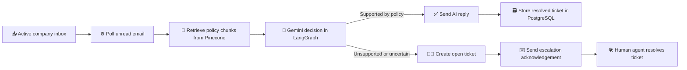

# ResolveX

> AI-assisted customer support triage with policy-grounded replies, human escalation, and multi-company isolation.

| Area | Technology |
| --- | --- |
| API | FastAPI |
| Agent workflow | LangGraph |
| Language model | Gemini via `langchain-google-genai` |
| Vector search | Pinecone |
| System of record | PostgreSQL with SQLAlchemy |
| Email | IMAP and SMTP |
| Frontend | Static HTML, CSS, and JavaScript |

## Capabilities

- 🏢 Multi-company onboarding with company-specific Pinecone namespaces
- 📥 Unread email ingestion through IMAP
- 🧠 Policy-grounded AI triage with Gemini and LangGraph
- ✅ Automatic replies only when policy context supports the answer
- 🧑‍💼 Human escalation with ticket tracking and acknowledgement emails
- 🔐 Company-scoped authentication and role-based access
- 📄 Document upload, indexing, listing, retrieval, and deletion
- 📊 Polling status and health endpoints for operations

## Workflow



The agent graph itself is:

```text
retrieve_context -> decide_resolution -> resolve or escalate
```

Automatic polling is enabled by default and runs for active companies every 30 seconds. Set `AUTO_POLL_ENABLED=false` to use the manual polling endpoint instead.

## Project Structure

- `AI_Services/app/main.py`: FastAPI entrypoint and background polling worker
- `AI_Services/app/agent/graph.py`: LangGraph workflow
- `AI_Services/app/agent/state.py`: graph state definition
- `AI_Services/app/pinecone_client.py`: embeddings, indexing, and retrieval
- `AI_Services/app/email_client.py`: IMAP/SMTP integration
- `AI_Services/app/services/email_processor.py`: end-to-end email processing
- `AI_Services/app/services/polling_status.py`: in-memory polling status
- `AI_Services/app/routers/*`: APIs for auth, companies, documents, ingestion, and tickets
- `AI_Services/app/static/*`: login and support dashboards
- `AI_Services/init_db.py`: optional manual database initialization utility
- `AI_Services/scripts/index_policies.py`: testing-only manual indexing utility

## Local Setup

### 1) Start local PostgreSQL

Ensure PostgreSQL is installed and running on your machine, and create the `customer_care` database.

Example with `psql`:

```bash
psql -U postgres -c "CREATE DATABASE customer_care;"
```

### 2) Python environment and dependencies

```powershell
cd AI_Services
python -m venv ..\.venv
..\.venv\Scripts\Activate.ps1
pip install -r requirements.txt
```

### 3) Configure environment

Create `AI_Services/.env` and update these values:

- `GEMINI_API_KEY`
- `GEMINI_MODEL`
- `GEMINI_EMBEDDING_MODEL`
- `PINECONE_API_KEY`
- `PINECONE_INDEX_NAME`
- `DATABASE_URL`
- `EMAIL_USER`, `EMAIL_PASSWORD`
- `IMAP_HOST`, `IMAP_PORT`, `SMTP_HOST`, `SMTP_PORT`, `SMTP_USE_TLS`
- `AUTO_POLL_ENABLED`, `AUTO_POLL_INTERVAL_SECONDS`, `POLL_MAX_COUNT`
- `TOP_K_DOCS`

### 4) Initialize the database

The application creates missing tables during startup. For a manual connection and table check, run this from `AI_Services`:

```powershell
python init_db.py
```

### 5) Index company docs/policies to Pinecone

The normal workflow is to upload documents through the authenticated document API or dashboard. Uploaded content is stored in PostgreSQL and its chunks are embedded into the company's Pinecone namespace.

`AI_Services/scripts/index_policies.py` is a testing-only manual utility. It is not called by the FastAPI application.

### 6) Run API

```powershell
cd AI_Services
uvicorn app.main:app --reload
```

Open: `http://localhost:8000`

Useful local URLs:

- `http://localhost:8000/` - login interface
- `http://localhost:8000/health` - database-backed health check
- `http://localhost:8000/docs` - FastAPI interactive API documentation

## Customer Care Login

1. Register human agent via `POST /api/auth/register/human-agent` using `username + company_email + password`.
2. Human login via `POST /api/auth/login/human` using `username + password`.
3. Customer care agents see and resolve unresolved tickets only for their own company.

The built-in web console supports:
- simple customer care login with username and password
- unresolved ticket listing and resolution

## API Endpoints

- `POST /api/auth/register/human-agent` - human agent registration (username + company email + password)
- `POST /api/auth/login/human` - human agent login (username + password)
- `GET /api/auth/me` - get current authenticated user profile
- `POST /api/company/register` - register a company and company administrator
- `POST /api/company/login` - company administrator login
- `GET /api/company/profile` - get company profile and document/agent counts
- `GET /api/company/agents` - list company agents
- `POST /api/company/settings` - update company email settings
- `POST /api/documents/upload` - upload and index a company document
- `GET /api/documents/list` - list company documents
- `GET /api/documents/{doc_id}/content` - retrieve document content
- `DELETE /api/documents/{doc_id}` - delete a document and its Pinecone chunks
- `POST /api/ingest/poll` - poll current company inbox + process unread emails (auth required)
- `GET /api/ingest/status` - view in-memory polling status
- `GET /api/tickets` - list company unresolved/resolved tickets (auth required)
- `PATCH /api/tickets/{ticket_id}` - resolve/update ticket (auth required)
- `GET /health` - health check

## Reply Ownership Rule

- Auto-resolved messages are replied by AI and recorded as resolved tickets.
- Escalated tickets are replied by human agents on resolve.
- A ticket prevents duplicate customer replies from multiple responders.

## Polling Behavior

Automatic polling is enabled by default. The FastAPI lifespan starts a background worker that polls active companies every 30 seconds, processing up to 20 emails per company per cycle.

Set `AUTO_POLL_ENABLED=false` to disable the background worker and use `POST /api/ingest/poll` manually.

Polling status is stored in memory and resets when the application restarts.

## Data Responsibilities

- PostgreSQL stores companies, users, uploaded documents, tickets, and email metadata.
- Pinecone stores searchable document vectors and chunk metadata.
- Gemini creates embeddings and makes the policy-supported resolution decision.

## Production Deployment Checklist

### 🔐 Secrets and identity

- Set a strong, randomly generated `SECRET_KEY`.
- Store `GEMINI_API_KEY`, `PINECONE_API_KEY`, `DATABASE_URL`, and email credentials in a secret manager.
- Use email app passwords or OAuth where supported; never commit credentials to the repository.
- Restrict company and ticket access through the existing role checks and verify them during deployment testing.

### 🗄️ Data and migrations

- Use a managed PostgreSQL instance with automated backups and SSL enabled.
- Use a production Pinecone index with the embedding dimension configured by `GEMINI_EMBEDDING_DIMENSION`.
- Treat `init_db.py` as a setup and verification utility, not as a migration system.
- Add a versioned migration process before making schema changes in production.

### 🚀 Application runtime

- Run behind a TLS-terminating reverse proxy or managed ingress.
- Set `DEBUG_MODE=false` and configure an explicit allowed-origin policy before exposing the API.
- Run the API with a process manager and configure restart and health-check policies.
- Review `AUTO_POLL_ENABLED` before scaling horizontally. Each active worker can poll inboxes independently.
- Ensure only one polling worker owns a given company inbox, or add distributed coordination before using multiple workers.

### 📈 Operations

- Monitor `/health`, `/api/ingest/status`, application logs, PostgreSQL, Pinecone, and email-provider failures.
- Alert on repeated polling errors, failed SMTP replies, and growing open-ticket counts.
- Back up PostgreSQL and document the Pinecone index recovery or re-indexing procedure.
- Test the escalation path before enabling automatic replies.

## Current Limitations

- Password reset and advanced identity management are not implemented.
- Audit logging is not yet persisted as a separate subsystem.
- `polling_status.py` keeps status in process memory and resets on restart.
- `init_db.py` does not replace a versioned database migration workflow.
